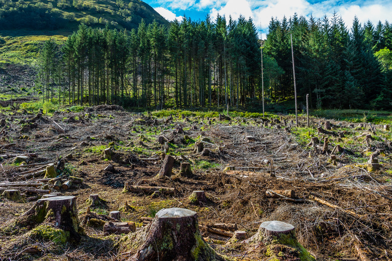

# Global Deforestation Project

  

## Table of Content

* [1. Project Description](#project-description)
* [2. Datasets](#dataset)
* [3. Packages](#packages)
* [4. Environment](#environment)
* [5. Team Members](#team-members)

## 1. Project Description 

brief overview of the project

Objectieves:
* To perform exploratory data analysis of the global deforestation dataset.
* To analyse the change in global forest area from 1990 and 2021, identifying trends of deforestation or afforestation for each country.
* To identify countries, regions and income levels that have the largest decrease and increase in forest area between 1990 and 2021.
* To determine the relationship between income status and rate of deforestation.
* To determine the relationship between various regions and rate of deforestation.

## 2. Datasets 

The dataset used in the project can be located [hyperlink the here] here.

## 3. Packages 

The following packages and libraries are essential for analysis and achieving the outlined objectives:

+ `numpy (version)`
+ `pandas (version)`
+ `seaborn (version)`
+ `matplotlib (version)`

## 4.Enivironment 

A virtual environment is used for the project (add more)

## 5.Team Members 

| Name                                                                                        |  Email              
|---------------------------------------------------------------------------------------------|--------------------             
| [Ntabiseng Mokhachane]()                                                                    | ntabisengmokhachane95@gmail.com
| [Laudicia Ramasenya]()                                                                      | laudiciaramasenya@gmail.com
| [Musa Khuzwayo]()                                                                           | musakhuzwayomedia@gmail.com
| [Obakeng Motalane]()                                                                        | lensitaliks@gmail.com
| [Khumbelo Dowelani]()                                                                       | dowelanikhumbelo@gmail.com